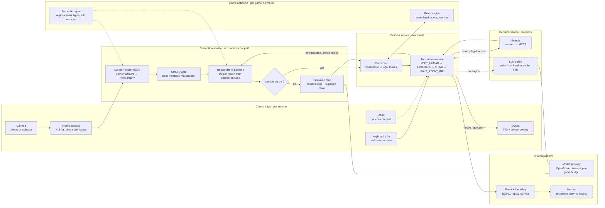

# Inkwatch architecture: a game-agnostic live-video game agent

Solid boxes = built for tic-tac-toe. Dashed boxes = designed, not built.

## 1. End-to-end flow
A frame is rectified, then held until the scene is stable (no hand, markers visible). Per-region ink is diffed against the last accepted baseline. **Exactly one new mark in a legal region, above threshold** goes straight to the session; anything else escalates one rectified crop to a VLM with the expected state as context. If the VLM still disagrees, the agent asks the human instead of guessing. The session applies the move, asks Decision for a reply, speaks it, then **arms that one region** and waits to see the agent's mark inked before the next turn.

- **Inference placement:** CV on client/edge CPU every frame (target <50 ms). VLM only on the low-confidence path (target <5% of turns, <3 s). Decision on CPU (<10 ms for tic-tac-toe).
- **Vendors:** OpenCV for perception. Gemini Flash-class via OpenRouter for escalation, a second vendor as fallback. Local TTS for the demo; streaming TTS/ASR (Cartesia or ElevenLabs, Deepgram) in production.
- **Latency target:** move acknowledged ≤1 s after the hand leaves the page on the happy path.

## 2. Services and boundaries

| Service | Needs a model? | Owns | Receives → Emits |
|---|---|---|---|
| Perception | No, except escalation and complex pieces | Calibration: homography, thresholds, baseline image (ephemeral) | Frames, baseline, armed region → `Observation{region, mark, confidence, frame_ts, crop_ref}` |
| Session | No | Game state, turn phase, move history, pending questions (persisted) | Observations, decisions, human answers → baseline updates, utterances |
| Rules engine | No | Nothing | State → legal moves, next state, terminal |
| Decision | Only without a formal engine | Nothing (optional shared cache by state hash) | State + legal moves → move |

Raw frames never cross to the session, only observations with a crop reference. The LLM policy can only choose from the rules engine's legal-move list, so it can never make an illegal move.

## 3. Shared vs per-tenant

| Shared across all games and users | Per game | Per user / session |
|---|---|---|
| VLM/LLM endpoints and weights, model gateway, CV runtime, search engines, eval harness | Rules module, perception spec, eval recordings, tuned default thresholds | Calibration, lighting and handwriting thresholds, session state, frame/event log, spend budget |

New games ship as a rules module plus perception spec. Natural-language rules can be compiled into a rules module offline by an LLM, but only after it passes generated test positions; they are never interpreted live.

## 4. Failure: what breaks first, and how we'd know

1. **Perception in real rooms** (glare, shadows, faint pencil, a lingering hand). Signal: escalation rate and confidence histogram per session; time-to-detect.
2. **Page/state desync** (bumped page, erased mark, move drawn in the wrong cell). Every stable frame also checks occupied cells against state; a lost or moved page triggers a full re-read (`RESYNC`). Signal: desync count; recovery is a spoken question, never a silent correction.
3. **Agent's move never drawn, or drawn elsewhere.** `WAIT_AGENT_INK` timeout and reprompt. Signal: armed-region timeouts.
4. **Model gateway latency or outage.** 3 s timeout and per-game budget (built); circuit breaker and second vendor (designed). Either way, fall back to asking the human. Signal: p95 escalation latency, breaker trips.
5. **Cost runaway** in bad lighting (escalation storm). Per-session escalation budget. Signal: spend per game.
6. **Generalization limit.** The "new ink appeared" assumption breaks for games where pieces move or are removed (chess, checkers). Those need a full region-state perception spec and a VLM or detector per read; this is the main cost of going game-agnostic.
