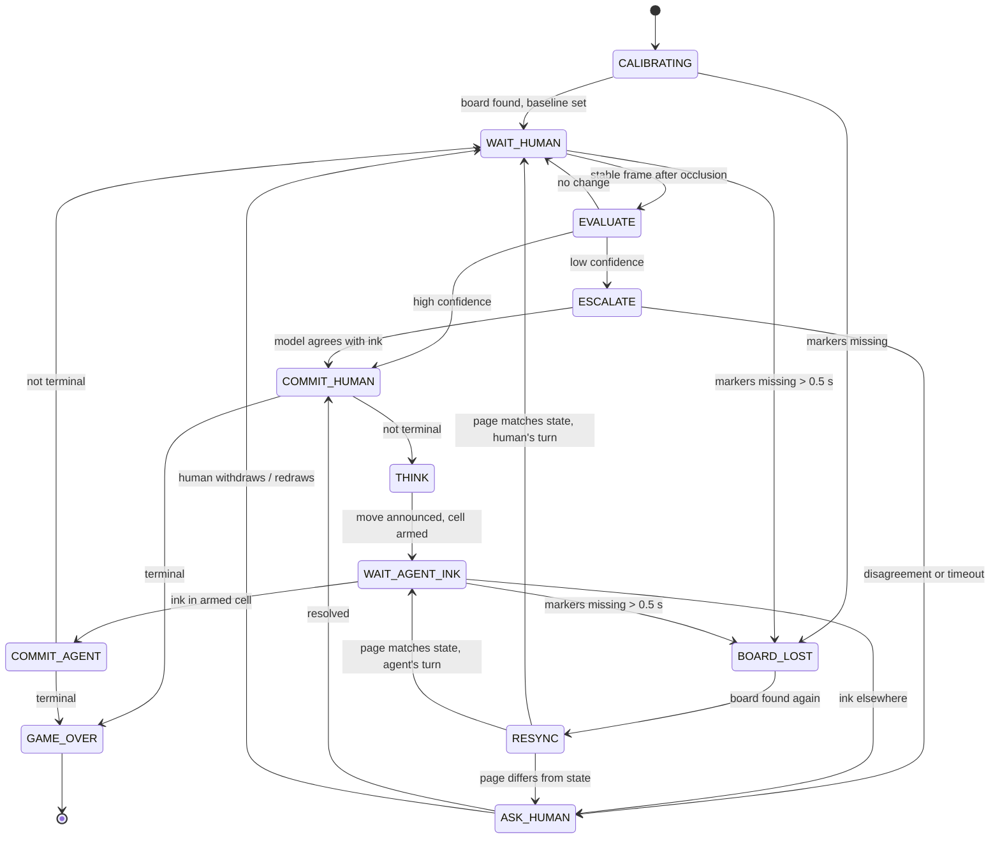

# Product Definition: Inkwatch

| | |
|---|---|
| **Status** | Draft v1, locked before build |
| **Owner** | Gad Sosa |
| **Companion docs** | `ARCHITECTURE.md` (system design), `README.md` (setup) |
| **Time-box** | ~5 focused hours for the working loop; docs and video on top |

---

## 1. Summary

A human plays tic-tac-toe against an AI agent on a real sheet of paper. A camera watches the page continuously. The human draws every mark, both their own and the agent's. The agent notices each new mark on its own, keeps the authoritative game state, picks its reply, and tells the human where to draw it. The game ends in a win or draw, and the board on paper matches the board the agent reports.

The product principle is simple: **ink on the page is the move.** The agent never assumes a move it did not see drawn, and it never guesses silently when it is unsure.

## 2. Problem and intent

Tic-tac-toe is the vehicle, not the product. The real problem is building an agent that reliably turns an unstructured, noisy physical scene into discrete, trustworthy events, in real time, and keeps a shared state with a human without drifting. That skill transfers to any game, and to many non-game workflows (forms, whiteboards, physical inspections).

So the product is judged on **reliability of the perception-to-state loop and the quality of recovery**, not on game strength. Game strength is solved with minimax.

## 3. Goals and non-goals

### Goals
1. Complete a full game end to end with no keyboard input on the happy path.
2. Detect a new human mark without being prompted, within about 1 s of the hand leaving the page.
3. Never accept an ambiguous board silently: escalate, then ask.
4. Keep page state and agent state identical at every turn boundary, and verify it at game end.
5. Near-zero cost per game: no model call on the happy path.
6. A stranger reaches a running game in under ten minutes from the README.

### Non-goals (this version)
- Training or fine-tuning any model.
- Arbitrary hand-drawn grids at arbitrary angles with no reference (documented as a fallback, not the primary path).
- Adjustable difficulty. The agent plays perfectly; the best a human can do is draw.
- Multiple simultaneous sessions, remote play, or a hosted service.
- Games other than tic-tac-toe (designed for in `ARCHITECTURE.md`, not built).

## 4. Users and setting

| Persona | Need |
|---|---|
| **Player** | Sit at a desk, draw on paper, play without touching the computer. Clear, short instructions about where to draw. |
| **Evaluator** (Vistral) | Clone, run, and play within ten minutes; understand every design decision; see honest limits. |
| **Developer** (future) | Replay recorded sessions to tune and regression-test perception without a camera. |

**Physical setting:** indoor desk, normal room lighting, a laptop webcam or a phone used as a webcam, mounted or propped roughly above the page (up to ~35° off vertical). Black or dark-blue marker or pen. Pencil is supported but not the target.

## 5. Assumptions (stated, since the brief leaves them open)

| # | Assumption | Why |
|---|---|---|
| A1 | The page is a printed sheet with four ArUco markers at the corners and a 3×3 grid, generated by `make_sheet.py`. | Robust, cheap rectification under movement and perspective. Removes the least interesting failure mode so the time goes into the loop. |
| A2 | Human plays **X** and moves first by default. `--agent-first` flips it. | Turn order tells perception which symbol to expect, so X/O classification is advisory, not required. |
| A3 | The human draws the agent's **O** in the cell the agent announces. | The brief: the human is the only hand. |
| A4 | One human, one page, one camera, one game at a time. | Scope. |
| A5 | Marks are only added, never erased, in a normal game. An erased or removed mark is an error state. | Matches how paper tic-tac-toe is played; keeps detection to "new ink appeared." |
| A6 | Output is spoken and displayed. Confirmation input is voice-free in the build (keyboard `y`/`n` as last resort); spoken yes/no is designed, not built. | TTS is cheap and local; ASR adds latency and a second failure surface for little gain in a 4-hour box. |
| A7 | English speech. | Scope. |

## 6. User experience

### 6.1 Setup flow
1. Print the sheet (or display it on a tablet laid flat).
2. Run `python -m inkwatch`. A window opens showing the camera feed.
3. The agent says: *"I can see the board. You're X, you go first."* If markers are not all visible, the overlay shows which corners are missing and the agent says *"I can't see the whole page. Please move it so all four corners are in view."*

### 6.2 Turn flow (happy path)
1. **Human's turn.** Overlay shows "Your move (X)". The human draws an X and moves their hand away.
2. **Detect.** Within ~1 s the agent says *"You played center."* and highlights the cell.
3. **Reply.** Immediately: *"I'll take top left. Please draw an O there."* The target cell pulses on the overlay.
4. **Verify.** The human draws the O. The agent says *"Got it."* and the turn passes back.
5. **End.** On a terminal state: *"Three in a row on the left column. You win."* / *"I win, diagonal from top left."* / *"It's a draw."* The agent re-reads the whole board, confirms it matches, and shows the final board.

### 6.3 Cell vocabulary
Rows: **top, middle, bottom.** Columns: **left, center, right.** Middle-center is spoken as **center**. Example: "bottom right", "middle left", "top center". Always paired with an on-screen highlight so a mishearing is visible.

### 6.4 Voice and tone
Short, calm, one instruction per utterance. The agent never lectures. When something is wrong it says what it sees and what it needs, e.g. *"I see new marks in two cells. Which one is your move?"*

### 6.5 Overlay (display)
- Rectified top-down board with cell grid.
- Per-cell state: empty / X / O, plus a debug ink-ratio number (toggle with `d`).
- Status banner: current phase and whose turn.
- Confidence indicator: green (accepted), amber (escalating), red (asking human).
- Target-cell highlight for the agent's move.

## 7. Functional requirements

### 7.1 Board perception
| ID | Requirement |
|---|---|
| P1 | Detect the four ArUco markers and compute a homography every frame; warp the grid to a fixed 600×600 top-down image. |
| P2 | If fewer than 4 markers are found, reuse the last homography for up to 1.5 s (`board_lost_hold_s`), then enter `BOARD_LOST`. |
| P3 | Divide the rectified board into 9 cells; measure ink only in each cell's inner area (inset ~15%) so grid lines don't count. |
| P4 | Ink measure = fraction of dark pixels after adaptive thresholding, compared against the **accepted baseline** for that cell. |
| P5 | A frame is **stable** when inter-frame change is below threshold for N consecutive frames (default 10 frames ≈ 0.6 s) and all markers are visible. Only stable frames are evaluated for moves. |
| P6 | Large frame change or marker occlusion marks the scene as **occluded** (hand present); no move is evaluated while occluded. |
| P7 | Symbol check (X vs O) is advisory: a cheap contour heuristic (O is closed and roughly circular). A mismatch with the expected symbol lowers confidence but does not block on its own. |

### 7.2 Move detection and confidence
| ID | Requirement |
|---|---|
| D1 | On each stable frame, classify each empty cell's ink delta as `none` (< T_low), `ambiguous` (T_low to T_high), or `marked` (≥ T_high). Defaults: T_low 2.5%, T_high 3.5% of inner-cell pixels (of a once-dilated ink mask — see `NOTES.md`); tuned on live recordings. |
| D2 | **High confidence** = exactly one empty cell `marked`, zero `ambiguous`, no occupied cell changed, cell is legal for the current turn. Accept immediately. |
| D3 | **Low confidence** = anything else (zero marks after a long occlusion, two marks, an ambiguous cell, symbol mismatch, change in an occupied cell). |
| D4 | Low confidence triggers **escalation**: send the rectified board and the current known state to a vision model and ask which single cell, if any, has a new mark. Timeout 3 s. |
| D5 | If escalation returns a single legal cell that is consistent with the ink data, accept it. Otherwise, or on timeout, **ask the human** (see §8). |
| D6 | A move is committed only after it has been confirmed on **two consecutive stable evaluations** (debounce against half-drawn marks). |
| D7 | Once a move is committed, the current rectified cell images become the new baseline. |

### 7.3 Game state and decision
| ID | Requirement |
|---|---|
| G1 | The session holds the single authoritative board, turn, move history and phase. Perception never mutates it directly; it only submits observations. |
| G2 | Legal-move and terminal checks live in a pure rules module with no I/O. |
| G3 | The agent's move is chosen by minimax (with alpha-beta; trivially fast). Ties broken by fixed preference order (center, corners, edges) for deterministic, testable play. |
| G4 | The agent announces its move and **arms** that cell: the only accepted next observation is new ink in that cell. |
| G5 | On a terminal state, announce the result and run a full-board re-read; if it disagrees with state, say so and show both. |

### 7.4 Output
| ID | Requirement |
|---|---|
| O1 | Speak every detection, move and question through local TTS (non-blocking; perception keeps running while speaking). |
| O2 | Never queue stale speech: a newer utterance cancels an older unsaid one. |
| O3 | Repeat the agent's move if its armed cell stays empty for 10 s, then every 20 s. |
| O4 | Everything spoken also appears as text on the overlay. |

### 7.5 Logging and replay
| ID | Requirement |
|---|---|
| L1 | Write a JSONL event log per session: observations, confidence, escalations (with latency and cost), commits, questions, answers, results. |
| L2 | Save the rectified frame at every commit, escalation, and question. |
| L3 | Optionally record the raw camera stream (`--record`) so perception can be replayed offline against the same frames. |
| L4 | `python -m inkwatch.replay <session>` runs the perception + session pipeline on a recording without a camera and outputs the event log for diffing. |

## 8. State machine



`RESYNC` re-reads all nine cells after the page moves or is lost, because the baseline is no longer trustworthy. It resumes whichever side's turn it already was — if the board was lost mid-`WAIT_AGENT_INK`, the agent's move is still armed and unconfirmed, so RESYNC re-arms the *same* target cell rather than picking a new one or waiting on the human for a move that isn't theirs to make.

## 9. Edge cases and required behavior

| Situation | Detected by | Agent behavior |
|---|---|---|
| Hand stays over the page | Occlusion never clears | Waits silently; after 15 s: *"Take your time. Move your hand away when you're done."* |
| Half-drawn mark, pen lifted briefly | Ink in `ambiguous` band / D6 debounce | Waits for two consistent stable reads before committing. |
| Human draws in an occupied cell | Change in an occupied cell | *"That cell is already taken. Please draw in an empty cell."* Keeps the old state. |
| Two new marks at once | Two `marked` cells | Escalate; if unresolved: *"I see two new marks. Which one is your move?"* Overlay shows both. |
| Human draws the agent's O in the wrong cell | Ink outside armed cell | *"I asked for top left, but I see a mark in top right."* Asks the human to fix the page (the paper stays the source of truth only once it matches a legal state). |
| Human draws out of turn (while agent is thinking or speaking) | New ink during `THINK` / before armed | Treats it as ink outside the armed cell (above). |
| Page bumped or rotated | Homography jump / markers lost | `BOARD_LOST` → `RESYNC` full re-read. |
| Shadow or glare over a cell | Ambiguous ink without occlusion | Escalate; if still unclear, ask the human to adjust the light or page. |
| Mark erased or removed | Occupied cell loses ink | *"A mark seems to have disappeared from center."* Pause until the page matches state again. |
| Camera disconnects | No frames for 2 s | *"I've lost the camera."* Retry every 2 s; resume via `RESYNC`. |
| Vision model timeout or no API key | Timeout / config | Skip straight to asking the human. The game stays fully playable offline. |
| Faint pen or pencil | Persistent ambiguous reads | Calibration at start lowers thresholds; if still ambiguous, escalate. Documented limit. |

**Recovery rule:** the agent never changes committed state on its own. Resolution always comes from a consistent page, a model read that matches the ink, or an explicit human answer.

## 10. Non-functional requirements

| Area | Target | Notes |
|---|---|---|
| Per-frame perception | < 50 ms on a laptop CPU | OpenCV only on the hot path. |
| Human move acknowledged | p50 ≤ 1.0 s, p95 ≤ 1.5 s after hand leaves | Dominated by the stability window (0.6 s). |
| Escalation path | p95 ≤ 3 s | Hard 3 s timeout. |
| Agent decision | < 10 ms | Minimax on ≤ 9! positions with pruning. |
| Cost per game | ≈ $0 happy path, < $0.01 worst case | Escalation budget: max 5 model calls per game. |
| Offline operation | Full game playable with no network | Escalation disables itself; asking the human covers it. |
| Setup time | < 10 min for a stranger | Measured by one dry run on a clean machine. |
| Secrets | No key in repo | `.env` + `.env.example`; key read from `OPENROUTER_API_KEY`. |
| Privacy | Frames stay local | Only a rectified board crop is sent on escalation; recording is opt-in. |

## 11. Model and vendor choices

| Need | Choice | Why |
|---|---|---|
| Board location | ArUco (OpenCV) | Deterministic, fast, free, handles perspective and movement. |
| Mark detection | Adaptive threshold + baseline diff | The question is "did ink appear here," not "what is this image." No model needed. |
| Low-confidence read | Fast, cheap vision model via OpenRouter (Gemini Flash class), prompted with the known state | Rare path; context of the known board turns an open vision task into a constrained yes/no. |
| Decision | Minimax | Perfect play, zero latency, fully testable. An LLM here would be slower, costlier and worse. |
| Speech | Local OS TTS (`say` / `pyttsx3`) | Zero latency and cost; good enough for short instructions. |
| Training | None | Nothing in the loop is bottlenecked by a model that training would fix. |

## 12. Configuration

`config.yaml`, all values overridable by CLI flags:

```yaml
camera: 0                 # index or stream URL
agent_first: false
voice: true
stability_frames: 10
motion_threshold: 2.0     # inter-frame pixel diff below which the scene counts as quiet (P5)
ink_threshold_low: 0.02
ink_threshold_high: 0.05
cell_inset: 0.15
escalation:
  enabled: true           # auto-false if no API key
  model: google/gemini-flash   # any OpenRouter vision model id
  timeout_s: 3
  max_calls_per_game: 5
reminder_s: [10, 20]
occlusion_reminder_s: 15  # §9: how long a lingering hand waits before "Take your time..."
record: false
log_dir: sessions/
```

## 13. Success metrics and acceptance criteria

### 13.1 Metrics (measured on a recorded eval set, not win rate)
| Metric | Definition | Target |
|---|---|---|
| Move detection accuracy | Committed moves that match ground truth / all moves | ≥ 98% |
| False triggers | Commits with no real mark, per 10 games | ≤ 1 |
| Escalation rate | Turns needing a model call / all turns | < 5% |
| Human-question rate | Turns needing a human answer / all turns | < 3% |
| Time to detect | Hand-leaves-page → spoken acknowledgement | p50 ≤ 1 s |
| End-of-game desync | Games where page ≠ reported final state | 0 |

Eval set: at least 10 recorded games including deliberate edge cases (two marks, wrong cell, page bump, lingering hand, shadow), labeled with ground-truth move timestamps.

### 13.2 Acceptance criteria for this submission
- [ ] A full game on video, human and page both in frame, ending in win or draw with page matching the agent's final report.
- [ ] Video includes at least one recovery (e.g., ambiguous or wrong-cell mark handled correctly).
- [ ] Game fully playable with escalation disabled.
- [ ] README gets a stranger to a running game in under ten minutes.
- [x] Rules and decision modules covered by unit tests; perception covered by at least one replay test (`tests/test_replay.py`, M5).
- [ ] No secrets committed.
- [ ] `ARCHITECTURE.md` one page, covering flow, services, shared vs per-tenant, failure.
- [ ] Known limits documented honestly.

## 14. Repository layout

```
inkwatch/
  __main__.py      # CLI entry, wires components, main loop
  perception.py    # markers, homography, stability, per-cell ink
  escalation.py    # vision-model read with timeout and budget
  session.py       # state machine, reconciler, baseline ownership
  rules.py         # pure tic-tac-toe rules
  decision.py      # minimax
  output.py        # TTS queue + overlay rendering
  replay.py        # offline pipeline over recordings
  metrics.py       # eval scoring: events.jsonl + a label -> §13.1's numbers
tools/make_sheet.py  # printable board with ArUco markers
tools/calibrate.py   # debug view: raw feed + rectified board, corner status
tests/             # rules, decision, replay, metrics
eval/              # ground-truth labels + how to record, label, score (§13)
config.yaml
README.md  PRODUCT.md  ARCHITECTURE.md
```

## 15. Milestones

| # | Milestone | Done when |
|---|---|---|
| M1 | Sheet + rectification | Stable top-down board in a debug window under real desk lighting. |
| M2 | Ink detection | Correct per-cell `none/ambiguous/marked` on 20 manual marks. |
| M3 | Playable loop | Full game with voice, no escalation, happy path only. |
| M4 | Recovery | All edge cases in §9 behave as specified. |
| M5 | Escalation + logging | Model call on low confidence, JSONL log, replay command. |
| M6 | Evidence | Eval recordings, metrics table filled with measured numbers, video recorded. |
| M7 | Docs | README dry run on a clean machine, architecture page final. |

M1–M4 are the must-have. M5–M7 get cut before M4 does.

## 16. Risks

| Risk | Likelihood | Impact | Mitigation |
|---|---|---|---|
| Lighting in the recording room differs from dev | High | High | Session-start calibration; tune on the actual recording setup; escalation as backstop. |
| Hand shadow reads as ink | Medium | High | Stability window + occlusion gate + two-read debounce. |
| Camera angle too steep for markers | Medium | Medium | README mounting guidance; phone-as-webcam option. |
| TTS blocks the frame loop | Medium | Medium | TTS on its own thread with cancellable queue. |
| Time-box overrun on polish | High | Medium | Milestone cut order in §15. |

## 17. Future: getting better across games (optional)

Game play cannot improve; minimax is already perfect. What can improve is **perception for a given user and room**: thresholds, stability window, and symbol heuristics calibrated from that user's past sessions.

**How we'd know it improved rather than got lucky:**
1. Freeze a labeled eval set of recordings, split by user and by session so tuning never sees the test games.
2. Run the replay harness with the old and new parameters on the same frames.
3. Compare detection accuracy, false triggers, escalation rate and time-to-detect, with bootstrap confidence intervals over games.
4. Ship the change only if it improves on held-out sessions without regressing any edge-case recording.

Win rate is explicitly not a signal: it measures the human, not the agent.

## 18. Open questions

1. Is a printed marker sheet acceptable, or does the evaluator expect a freehand grid? (Assumed acceptable; freehand documented as fallback.)
2. Should the agent ever let the human win (difficulty)? (Assumed no.)
3. Is spoken confirmation from the human expected, or is page-based recovery enough? (Assumed page-based plus keyboard last resort.)
